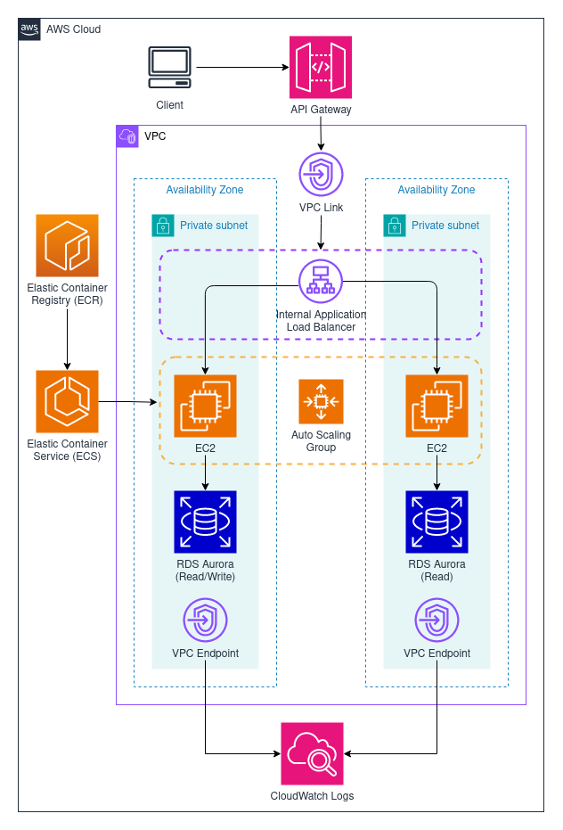

# Social Media Backend Example

## About
An example social media backend using AWS. This project demonstrates the use of an API using a ECS cluster and RDS
backend. The API is publicly accessible using a custom domain configuration for API gateway. The API
gateway uses a VPC link to reach a services within a private VPC across multiple subnets.
Traffic is sent to an application load balancer then to ECS. ECS uses Secrets Manager to obtain credentials to connect to RDS.
  The project is designed for use with a hybrid of local and cloud development.




## Usage

### Requirements
- Setup credentials for AWS CLI
- Create a file `./terraform/terraform.tfvars` and populate it using variables described in `./terraform/variables.tf`

### Local Development
The ECS image can be developed and tested locally using a local PostgreSQL database using docker compose.

- Run `docker compose build` to build image for the ECS container.
- Start up docker compose with `docker compose up -d` to run local PostgreSQL and ECS container.

### Cloud Development

Use infrastructure as code to create AWS services.

Initialize terraform.

`terraform init`

Create infrastructure.

`terraform apply`

Build and tag ECS image with name of your ECR repo url that was output from terraform.

`docker build -t <ecr-repo-url>:latest .`

Authenticate docker

`aws ecr get-login-password --region region | docker login --username AWS --password-stdin aws_account_id.dkr.ecr.region.amazonaws.com`

Push to ECR

`docker push <ecr-repo-url>:latest`

### Optional

Taskfiles have been included in the project to quickly run preconfigured build and run scripts. Install taskfile and run `task --list-all` to view commands available in a given directory.

## API Usage

### Users

<details>
<summary>
<code>POST</code> /users
</summary>

Create a new user.

```bash
curl -X POST -H "Content-Type: application/json" \
  -d '{"username":"John123","profileName":"Johnny"}' \
  http://localhost:8080/users

# Response
{"userId":"23"}
```

</details>


<details>
<summary>
<code>GET</code> /users/{:id}
</summary>

Get a user

```bash
curl -X GET http://localhost:8080/users/3

# Response
{"username":"smith","profileName":"John Smith"}
```

</details>

<details>
<summary>
<code>PUT</code> /users/{:id}
</summary>

Update a user

```bash
curl -X PUT -H "Content-Type: application/json" \
  -d '{"username":"smith","profileName":"Elizabeth Smith"}' \
  http://localhost:8080/users/3
```

</details>

<details>
<summary>
<code>DELETE</code> /users/{:id}
</summary>

Delete a user

```bash
curl -X DELETE http://localhost:8080/users/3
```

</details>

### Posts

<details>
<summary>
<code>GET</code> /posts
</summary>

Get posts

```bash
curl -X GET "http://localhost:8080/posts?id=1&last-id=0&size=5"

# Response
[{"postId":"4","body":"example post","likes":0},{"postId":"3","body":"another example post","likes":0},{"postId":"2","body":"post by user 1","likes":0},{"postId":"1","body":"yet another example post","likes":0}]
```

</details>

<details>
<summary>
<code>POST</code> /posts
</summary>

Create a new post

```bash
curl -X POST -H "Content-Type: application/json" \
  -d '{"userId":"4","body":"test post"}' \
  http://localhost:8080/posts

# Response
{"postId":"123"}
```

</details>

<details>
<summary>
<code>PUT</code> /posts/{:post-id}
</summary>

Update a post

```bash
curl -X PUT -H "Content-Type: application/json" \
  -d '{"body":"edited post"}' \
  http://localhost:8080/posts/123
```

</details>

<details>
<summary>
<code>DELETE</code> /posts/{:post-id}
</summary>

Delete a post

```bash
curl -X DELETE http://localhost:8080/posts/123
```

</details>

### Comments

<details>
<summary>
<code>GET</code> /comments
</summary>

Get comments from a post with pagination

```bash
curl -X GET "http://localhost:8080/comments?id=2&last-id=1&size=5"

# Response
[{"postId":"2","username":"molly1234","body":"comment 5"},{"postId":"2","username":"molly1234","body":"comment 4"},{"postId":"2","username":"molly1234","body":"comment 3"},{"postId":"2","username":"molly1234","body":"comment 2"},{"postId":"2","username":"molly1234","body":"comment 1"}]
```

</details>

<details>
<summary>
<code>POST</code> /comments
</summary>

Create a new comment on a post

```bash
curl -X POST -H "Content-Type: application/json" \
  -d '{"userId":"5","postId":"3","body":"test comment"}' \
  http://localhost:8080/comments

# Response
{"commentId":"123"}
```

</details>

<details>
<summary>
<code>PUT</code> /comments/{:comment-id}
</summary>

Update a comment on a post

```bash
curl -X PUT -H "Content-Type: application/json" \
  -d '{"body":"updated comment"}' \
  http://localhost:8080/comments/123
```

</details>

<details>
<summary>
<code>DELETE</code> /comments/{:comment-id}
</summary>

Delete a comment on a post

```bash
curl -X DELETE http://localhost:8080/comments/11
```

</details>

### Followers

<details>
<summary>
<code>GET</code> /followers
</summary>

Get followers with pagination

```bash
curl -X GET "http://localhost:8080/followers?id=4&last-id=2&size=5&following=true"

#Response
{"userIds":["3","5","6","7","8"],"usernames":["smith","123sarah","321Josh1","1Jjake","theChris"]}
```

</details>

<details>
<summary>
<code>POST</code> /followers
</summary>

Create a follower

```bash
curl -X POST -H "Content-Type: application/json" \
  -d '{"followerId":"3","followeeId":"5"}' \
  http://localhost:8080/followers
```

</details>

<details>
<summary>
<code>DELETE</code> /followers
</summary>

Delete a following relationship

```bash
curl -X DELETE -H "Content-Type: application/json" \
  -d '{"followerId":"4","followeeId":"5"}' \
  http://localhost:8080/followers
```

</details>


### NewsFeed (TODO)

<details>
<summary>
<code>Get</code> /feed
</summary>

Get newsfeed for user with pagination

</details>

